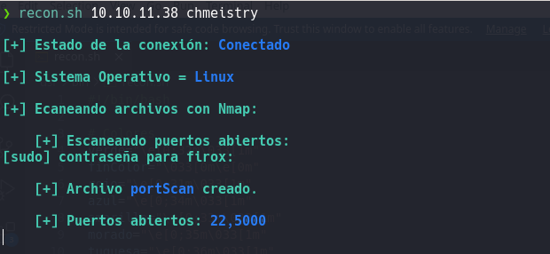
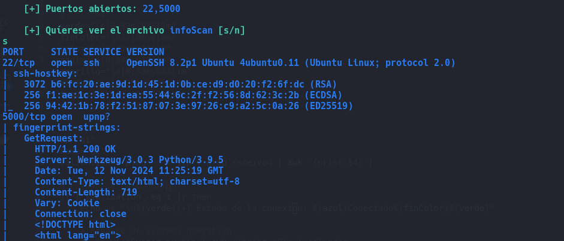
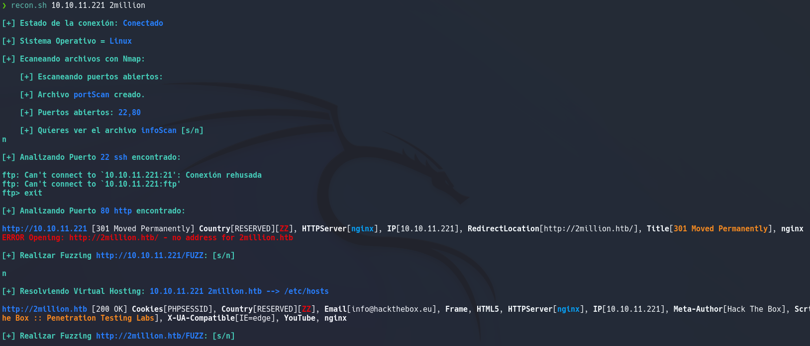

# ReconBox
💻📦🔎 Script en bash para el reconocimiento y escaneo de las máquinas de Hack The Box. 🔍📦💻


### ⚙️⚙️ Requisitos Previos ⚙️⚙️

Antes de utilizar el script, asegúrate de tener las herramientas necesarias instaladas en tu sistema:

    Nmap: Para escanear puertos y servicios.
    WhatWeb: Para identificar tecnologías web utilizadas por un servidor.
    WFuzz: Para realizar fuzzing y encontrar directorios o archivos ocultos en aplicaciones web.
    Rsync: Para realizar escaneos de posibles directorios compartidos.
    MongoDB tools: Para interactuar con bases de datos MongoDB.


## 🤖🤖 Descripción del Script 🤖🤖

El script está diseñado para realizar un escaneo completo en una máquina objetivo. Utiliza una combinación de herramientas de escaneo como Nmap, WhatWeb, WFuzz, Rsync y MongoDB tools para obtener información detallada sobre la máquina objetivo. A continuación, desglosamos los pasos clave de su funcionamiento:
### 🔹 1. Verificación de la Conexión

El script comienza verificando si la máquina objetivo está accesible a través de ping. Si la máquina responde, continúa con los siguientes pasos. En caso de que la conexión falle, se detiene y muestra un mensaje de error.
```
validation=$(ping -c 1 $ip | grep received | awk '{print $4}')
if [ $validation -eq 1 ]; then
    echo -e "\n${verde}[+] Estado de la conexión: ${azul}Conectado${finColor}${verde}"
```
### 🔹 2. Detección del Sistema Operativo

Una vez confirmada la conectividad, el script intenta identificar el sistema operativo de la máquina objetivo utilizando el script wichSystem.py (probablemente un script personalizado o uno de herramientas comunes de OS detection como nmap o p0f). Si el sistema operativo es Linux o Windows, se imprime la información en la consola.
```
so="$(wichSystem.py $ip | awk '{print $5}' | column)"
if [[ $so = "Linux" || $so = "Windows" ]]; then
    echo -e "\n[+] Sistema Operativo = ${azul}$so${finColor}${verde}"
else
    echo -e "\n[+] Sistema Operativo Desconocido."
fi
```


### 🔹 3. Escaneo de Puertos con Nmap

El script realiza un escaneo completo de puertos utilizando Nmap, que identifica puertos abiertos en la máquina objetivo. Si el archivo de resultados portScan ya existe, pregunta al usuario si desea realizar un nuevo escaneo. De no ser así, se reutiliza el archivo anterior.
```
if [ -e "./portScan" ]; then 
    echo -e "\n    [+] El archivo ${azul}portScan${verde} ya existe, desea volver a realizar el Escaneo? [s/n]"
    read respuesta
    if [ "$respuesta" = "s" ]; then
        sudo nmap -p- -sS --open --min-rate 5000 -v -n $ip -oG portScan 2&>/dev/null
    fi
else
    sudo nmap -p- -sS --open --min-rate 5000 -v -n $ip -oG portScan 2&>/dev/null
fi
```
Los puertos abiertos se extraen del archivo portScan y se muestran al usuario en la consola.
```
ports="$(cat portScan | grep -oP '\d{1,5}/open' | awk '{print $1}' FS='/' | xargs | tr ' ' ',')" 
echo -e "\n    [+] Puertos abiertos: ${azul}$ports${finColor}${verde}"
```

### 🔹 4. Escaneo de Servicios en Puertos Específicos

Para los puertos más comunes como 21 (FTP), 22 (SSH), 80 (HTTP) y 443 (HTTPS), el script realiza escaneos adicionales para obtener más información sobre los servicios y aplicaciones corriendo en esos puertos. En el caso del puerto 80 (HTTP), también utiliza WhatWeb para identificar tecnologías web.
```
if [[ "$ports" == *"80"* ]]; then
    sudo whatweb "$ip"
    # Si WhatWeb detecta tecnologías web, se ofrece la posibilidad de realizar fuzzing.
    echo -e "\n${verde}[+] Realizar Fuzzing ${azul}http://$ip/FUZZ${finColor}${verde}: [s/n] \n"
    read respuesta2
    if [ "$respuesta2" = "s" ]; then
        wfuzz -w /usr/share/wordlists/directory-list-2.3-big.txt --hc 404 http://$ip/FUZZ
    fi
fi
```



### 🔹 5. Fuzzing y Escaneo de Directorios con WFuzz

El script permite realizar fuzzing en aplicaciones web encontradas en el puerto 80 o 443. Esto ayuda a identificar directorios o archivos ocultos que podrían contener información sensible.
```
wfuzz -w /usr/share/wordlists/directory-list-2.3-big.txt --hc 404 http://$ip/FUZZ
```
### 🔹 6. Escaneo de Otros Puertos Específicos

El script también está diseñado para realizar escaneos específicos en otros puertos, como Rsync (puerto 873) o MongoDB (puerto 27017). En el caso de MongoDB, el script intenta realizar un dump de la base de datos para obtener posibles flags.
```
if [[ "$ports" == *"27017"* ]]; then
    mongodump --host $ip --port 27017
    rutaflag="$(find ./dump | grep flag.bson)"
    if [[ -n "$rutaflag" ]]; then
        echo -e "\n[+] Hemos encontrado la palabra flag en la siguiente ruta:\n\n ${azul}${rutaflag}${verde}"
        catRutaFlag=$(cat $rutaflag | tr -d '\0')
        echo -e "\n[+] Con el siguiente contenido:"
        echo -e "\n ${azul}$catRutaFlag${verde}"
    fi
fi
```



